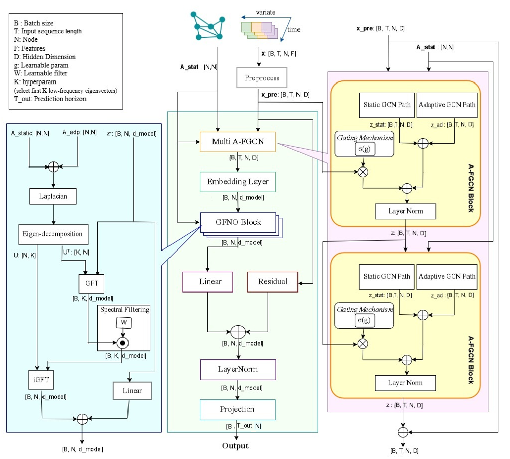
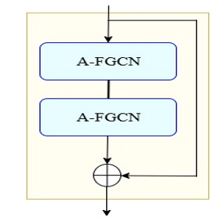
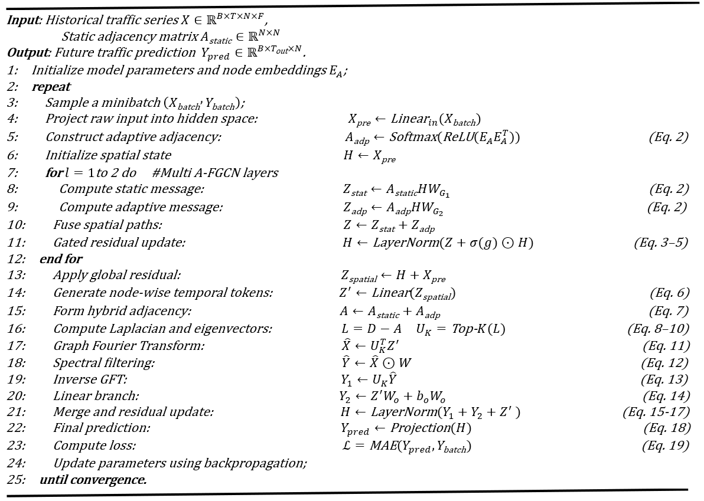

# HG-GFNO: Hybrid Graph Convolutions and Graph Fourier Neural Operator for Long-Term Traffic Prediction

## ⚠️ Important Note

This repository is **not the official implementation** of the paper.

👉 The **official and maintained repository** associated with the accepted paper is available at:

(https://github.com/majidhosseini87/HG-GFNO-Traffic-Prediction-ITS)

This repository represents an **earlier development version** and is maintained for
personal research, experimentation, and transparency purposes.

**Integrated Spatio-Temporal Modeling with Hybrid Graph Convolutions and the Graph Fourier Neural Operator for Traffic Prediction**

📌 Intelligent Transportation Systems (ITS)  
📌 Long-Horizon Traffic Forecasting  
📌 Graph Neural Networks & Spectral Learning

---

## 📄 Paper Information

- **Title:** Integrated Spatio-Temporal Modeling with Hybrid Graph Convolutions and the Graph Fourier Neural Operator for Traffic Prediction  
- **Authors:**  
  - Seyed-Majid Hosseini  
  - **S. Mozhgan Rahmatinia**  
  - Seyed-Amin Hosseini-Seno  
- **Affiliation:**  
  Department of Computer Engineering, Ferdowsi University of Mashhad, Iran
- **Corresponding Author:** hosseini@um.ac.ir

---

## 🧠 Abstract

Accurate long-term traffic forecasting is a critical component of resilient Intelligent Transportation Systems (ITS), enabling proactive congestion management, energy optimization, and robust urban mobility planning. However, existing spatio-temporal models often struggle to jointly capture complex spatial dependencies on non-Euclidean road networks and long-range temporal dynamics in an efficient and scalable manner.

To address these challenges, we propose **HG-GFNO**, a unified and parameter-efficient spatio-temporal forecasting framework that integrates **Hybrid Static–Adaptive Graph Convolutions** with a novel **Graph Fourier Neural Operator (GFNO)**. HG-GFNO extends spectral operators to graph domains, enabling global temporal modeling with linear complexity while dynamically adapting spatial representations.

Extensive experiments on four large-scale benchmark datasets (PEMS03, PEMS04, PEMS07, and PEMS08) demonstrate that HG-GFNO consistently outperforms state-of-the-art Transformer-, Mamba-, and Graph-based baselines, particularly for long forecasting horizons, while achieving superior stability and computational efficiency.

---

## ✨ Key Contributions

- 🔹 **Graph Fourier Neural Operator (GFNO):**  
  Introduces a novel spectral-temporal operator that generalizes Fourier Neural Operators to graph-structured data.

- 🔹 **Hybrid Static–Adaptive Graph Modeling:**  
  Combines physical road topology with data-driven adaptive adjacency learning via A-FGCN.

- 🔹 **Unified Spatio-Temporal Architecture:**  
  Seamlessly integrates spatial graph modeling and global spectral-temporal learning in a single framework.

- 🔹 **Linear-Complexity Long-Range Forecasting:**  
  Avoids heavy recurrent or attention-based mechanisms while capturing global dependencies efficiently.

- 🔹 **State-of-the-Art Performance:**  
  Achieves up to **10.9% RMSE** and **11.9% MAE** improvement over strong baselines across multiple horizons.

---

## 🏗️ Model Overview

HG-GFNO consists of three main components:

1. **Multi A-FGCN (Spatial Module)**  
   - Hybrid static and adaptive graph convolutions  
   - Node-specific parameterization via matrix factorization  
   - Gated fusion with residual connections  

2. **Sequence-as-Token Embedding**  
   - Encodes node-level temporal sequences into latent tokens  
   - Enables global temporal modeling without sequential processing  

3. **Graph Fourier Neural Operator (GFNO)**  
   - Spectral filtering in the graph Fourier domain  
   - Captures long-range dependencies with linear complexity  
   - Parallel linear residual branch for local feature preservation  

---

## 🖼️ Architecture Visualization

Overall architecture of HG-GFNO integrating hybrid graph convolutions and spectral-temporal learning.

Hybrid static–adaptive graph convolution block with residual connections.

Algorithm 1. Training Procedure of the Proposed HG-GFNO Model

📊 Datasets

Experiments are conducted on four public benchmark datasets from Caltrans PeMS:

PEMS03 (358 nodes)

PEMS04 (207 nodes)

PEMS07 (883 nodes)

PEMS08 (170 nodes)

Data Characteristics:

5-minute aggregation

288 timesteps per day

Train / Validation / Test split: 60% / 20% / 20%

📈 Evaluation Metrics

Mean Absolute Error (MAE)

Root Mean Squared Error (RMSE)

Statistical validation using:

Wilcoxon signed-rank test

Average rank analysis across datasets and horizons

🧪 Experimental Results

HG-GFNO consistently outperforms:

Transformer-based models (Informer, Autoformer, FEDformer, iTransformer)

State-space models (MambaTS)

Graph-based baselines (AGCRN, DDGCRN, ASTGCN, STFGNN, MGCN)

✔ Superior long-horizon accuracy (48, 96 steps)
✔ Stable convergence behavior
✔ Lower parameter count and memory footprint

⚙️ Computational Efficiency

Linear complexity w.r.t. input sequence length

No quadratic attention or recurrent bottlenecks

Stable GPU memory usage and fast per-iteration runtime

🖥️ Environment

Python ≥ 3.10

PyTorch

NumPy, Pandas

GPU: NVIDIA RTX series (tested on RTX 4080)

📂 Repository Structure
HG-GFNO-Traffic-Prediction-ITS/
├── data/
├── models/
│   ├── afgcn.py
│   ├── gfno.py
│   └── hg_gfno.py
├── train.py
├── test.py
├── utils/
├── requirements.txt
└── README.md📊 Datasets

Experiments are conducted on four public benchmark datasets from Caltrans PeMS:

PEMS03 (358 nodes)

PEMS04 (207 nodes)

PEMS07 (883 nodes)

PEMS08 (170 nodes)

Data Characteristics:

5-minute aggregation

288 timesteps per day

Train / Validation / Test split: 60% / 20% / 20%

📈 Evaluation Metrics

Mean Absolute Error (MAE)

Root Mean Squared Error (RMSE)

Statistical validation using:

Wilcoxon signed-rank test

Average rank analysis across datasets and horizons

🧪 Experimental Results

HG-GFNO consistently outperforms:

Transformer-based models (Informer, Autoformer, FEDformer, iTransformer)

State-space models (MambaTS)

Graph-based baselines (AGCRN, DDGCRN, ASTGCN, STFGNN, MGCN)

✔ Superior long-horizon accuracy (48, 96 steps)
✔ Stable convergence behavior
✔ Lower parameter count and memory footprint

⚙️ Computational Efficiency

Linear complexity w.r.t. input sequence length

No quadratic attention or recurrent bottlenecks

Stable GPU memory usage and fast per-iteration runtime

🖥️ Environment

Python ≥ 3.10

PyTorch

NumPy, Pandas

GPU: NVIDIA RTX series (tested on RTX 4080)

📂 Repository Structure

HG-GFNO-Traffic-Prediction-ITS/
├── data/
├── models/
│   ├── afgcn.py
│   ├── gfno.py
│   └── hg_gfno.py
├── train.py
├── test.py
├── utils/
├── requirements.txt
└── README.md

